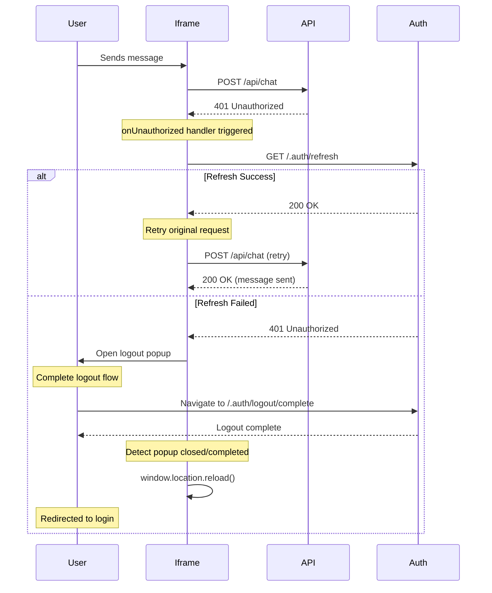

# A2A Chat Iframe App

The iframe application for embedding A2A Chat in your web applications.

## Features

- Embeddable chat widget via iframe
- Single and multi-session support
- Theme customization
- Secure cross-origin communication
- App Service EasyAuth integration with automatic token refresh

## Authentication Handling

The iframe app includes built-in support for App Service EasyAuth with automatic token refresh and re-authentication flows.

### How it works

1. **401 Detection**: When any API call returns a 401 Unauthorized status
2. **Token Refresh**: Automatically attempts to refresh the token via `/.auth/refresh`
3. **Re-authentication**: If refresh fails, opens a popup for user re-authentication
4. **Page Reload**: After logout completes, the page reloads to force login

### Configuration

Authentication handling is automatically configured when you embed the iframe. The base URL is determined from the agent card URL.

### Example Usage

```html
<!DOCTYPE html>
<html>
  <head>
    <title>A2A Chat Integration</title>
  </head>
  <body>
    <!-- Iframe with agent card URL -->
    <iframe
      src="https://your-app.azurewebsites.net/chat/iframe?agentCard=https://your-app.azurewebsites.net/api/agents/assistant/.well-known/agent.json"
      width="100%"
      height="600px"
      frameborder="0"
    >
    </iframe>
  </body>
</html>
```

### Multi-Session Mode

```html
<iframe
  src="https://your-app.azurewebsites.net/chat/iframe?agentCard=https://your-app.azurewebsites.net/api/agents/assistant/.well-known/agent.json&multiSession=true"
  width="100%"
  height="600px"
  frameborder="0"
>
</iframe>
```

### Authentication Flow



### Customization

You can customize the authentication behavior by modifying the `authHandler.ts` file:

- Adjust popup window size
- Change timeout durations
- Add custom logging or analytics
- Implement alternative re-authentication flows

### Security Considerations

1. **Same-Origin Policy**: Token refresh only works within the same origin
2. **Popup Blockers**: Falls back to redirect if popups are blocked
3. **Cross-Origin Isolation**: Authentication state is isolated per origin

## Development

```bash
# Install dependencies
pnpm install

# Start development server
pnpm dev

# Run tests
pnpm test

# Build for production
pnpm build
```

## Testing Authentication

To test the authentication flow:

1. Set up App Service with EasyAuth enabled
2. Configure token expiration (default 24 hours)
3. Test token refresh by waiting for expiration
4. Verify logout/login flow works correctly

## Troubleshooting

### Popup Blocked

If the logout popup is blocked, the app will redirect directly to the logout URL.

### Cross-Origin Errors

Ensure your iframe is served from the same domain as your API to avoid cross-origin issues with authentication.

### Token Refresh Fails

Check that the `/.auth/refresh` endpoint is properly configured in your App Service.
